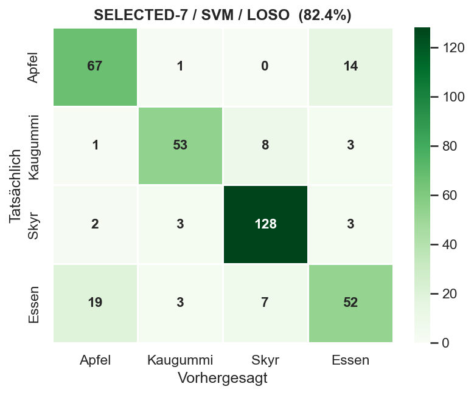

# ChewML — Food Classification via AirPod IMU

**Semester project · Machine Learning for Smart and Connected Systems**  
Jonah Karstens · Solo project

---

## Members


**Jonah Karstens** — full project (solo)

---

## Research Question

> Can chewing patterns captured via in-ear IMU sensors (AirPods Pro) be used to classify different foods — and distinguish eating from not eating?

---

## Project Idea

Most food-tracking approaches rely on manual input or cameras. This project explores a more passive alternative: using the motion sensors already built into AirPods Pro. Chewing different foods creates distinct jaw-movement patterns that show up in accelerometer, gyroscope, and orientation data sampled at ~50 Hz via the **Sensor Logger** iOS app.

The model works in two stages: first **eating vs. not eating**, then the specific food — **apple**, **chewing gum**, or **skyr/yogurt** — with a generic **"eating"** fallback for anything else.

---

## Status

The pipeline has grown from a rough proof of concept into a working **2-stage hierarchical classifier** with engineered features, cross-session evaluation, and a **live real-time app**. The main limitation is data: all recordings are from a single subject, so cross-session generalisation is the real ceiling.

| Component | Status |
|---|---|
| Dataset (~78 sessions, single subject, 5 classes) | ✅ |
| Preprocessing & feature engineering (52 features) | ✅ |
| 2-stage model (Still vs. Eating → food type) | ✅ Random Forest + SVM |
| Cross-session (LOSO-aware) feature selection | ✅ |
| Live real-time app (per-meal voting) | ✅ |
| Multi-subject data & generalisation | ⏳ Open — the key remaining issue |

---

## Results

- **Within-session (LOO):** ~93% on the fine food classification.
- **Cross-session (LOSO):** the honest metric. Feature engineering plus pruning session-specific features raised it from 76% to ~86% in the best configuration (realistically ~80% given the small single-subject dataset).
- A deep-learning check (1D-CNN on raw signals + augmentation) only *ties* the feature-based model — at this data scale, engineered features win.
- The **live app** classifies in real time and aggregates per meal via majority voting (~87% per-meal).



---

## Project Structure

```
data/raw/          Raw recordings (ZIP archives, one per session)
notebooks/         Exploratory analysis & experiments
ml_httpstreaming/  Live real-time classification app
reports/           Weekly progress reports
results/           Plots and outputs from experiments
src/               Preprocessing, training, and evaluation scripts
```

---

## Setup

```bash
pip install -r requirements.txt
```

---

## Weekly Reports

- [Week 1](reports/week01.md)
- [Week 5](reports/week05.md)
- [Week 6](reports/week06.md)
- [Week 7](reports/week07.md)
- [Week 8](reports/week08.md)
- [Week 9](reports/week09.md)
