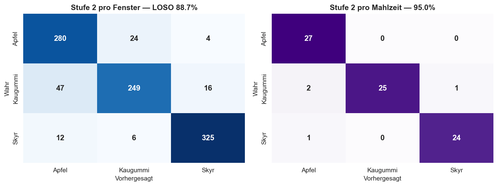

# ChewML — Food Classification via AirPod IMU

**Semester project · Machine Learning for Smart and Connected Systems (ML4SCS)**  
Leuphana Universität Lüneburg · Summer term 2026 · Jonah Karstens · Solo project

**Final report:** [reports/Projektdokumentation_ChewML_final_karstens.pdf](reports/Projektdokumentation_ChewML_final_karstens.pdf)  
**Slides:** [final presentation](reports/chewML_Abschlusspräsentation_final_karstens.pdf) · [interim presentation](reports/chewML_Zwischenpräsentation_karstens.pdf)  
**Videos:** [live demo of the app](https://www.youtube.com/watch?v=APkBl8B37zE) · [2-minute project intro](https://www.youtube.com/watch?v=n9Op2ja_2zE)

---

## Members


**Jonah Karstens** — full project (solo)

---

## Research Question

> Can chewing patterns captured via in-ear IMU sensors (AirPods Pro) be used to classify different foods — and distinguish eating from not eating?

---

## Project Idea

Most food-tracking approaches rely on manual input or cameras. This project explores a more passive alternative: using the motion sensors already built into AirPods Pro. Chewing different foods creates distinct jaw-movement patterns that show up in accelerometer, gyroscope, and orientation data sampled at ~50 Hz via the **Sensor Logger** iOS app.

No audio is used at any point — the pipeline runs on IMU signals alone, on an unmodified consumer device.

The model works in two stages: first **eating vs. not eating**, then the specific food — **apple**, **chewing gum**, or **skyr/yogurt**.

---

## Status

Complete. The pipeline runs end to end, from a live sensor stream to a per-meal decision, and the shipped configuration is verified against an unbiased cross-session protocol.

| Component | Status |
|---|---|
| Dataset (103 recordings, single subject, 5 classes) | ✅ |
| Preprocessing & feature engineering (52 features) | ✅ |
| 2-stage model (Still vs. Eating → food type) | ✅ Random Forest + SVM |
| Cross-session (LOSO) evaluation of the shipped config | ✅ NB15 |
| Live real-time app (per-meal voting) | ✅ |
| Written report & presentations | ✅ see top of page |
| Multi-subject data & generalisation | ⏳ Open — the key remaining limitation |

---

## Dataset

103 recordings · 1522 windows (10 s, non-overlapping) · 52 features · single subject.

| Class | Recordings | Windows |
|---|---|---|
| Apple | 27 | 308 |
| Chewing gum | 28 | 312 |
| Skyr | 25 | 343 |
| Still | 19 | 356 |
| Eating (generic) | 4 | 203 |

---

## Results

All numbers below come from [`notebooks/15_final_verification.ipynb`](notebooks/15_final_verification.ipynb), which reproduces the **shipped** configuration of [`ml_httpstreaming/classifier_app.py`](ml_httpstreaming/classifier_app.py) exactly: Stage 1 is a RandomForest on 14 features over movement-excluded windows with a 0.75 confidence rule; Stage 2 is an RBF-SVM on raw windows with movement exclusion off.

| Metric | Result |
|---|---|
| Stage 1 (Still vs. Eating), LOSO | **94.68 %** (balanced 94.48 %) |
| Stage 2 per window, LOSO | **88.68 %** |
| Stage 2 per meal (majority vote) | **95.00 %** (76/80) |
| End-to-end per window | **87.49 %** |
| End-to-end per meal | **95.00 %** (76/80) |
| Within-session (80/20 split) | 93.78 % |

The gap between the last two rows is the honest part of the story: mixing windows from the same recording across train and test inflates the score, so **cross-session LOSO is the metric that counts**.

Stage-2 feature selection (group-aware permutation importance) is recomputed **inside every LOSO fold** on training data only. It keeps a median of 42 of 52 features, ranging from 14 to 48 across folds — the selection is not stable, which is worth knowing before quoting any single feature count.



Skyr is the most reliable class and apple the weakest, which runs counter to the expectation from the literature that hard, crunchy foods would be easiest. The main error is apple ↔ chewing gum confusion.

A deep-learning check (1D-CNN on raw signals + augmentation, NB10) only *ties* the feature-based model — at this data scale, engineered features win.

**Limitation:** all recordings come from a single subject. Cross-session LOSO is a proxy for generalisation, not a substitute for cross-subject validation.

---

## Live App

```bash
pip install -r requirements.txt
python ml_httpstreaming/classifier_app.py
```

The app trains both model sets on startup (with and without movement exclusion), then serves on port 8000:

- Web UI — `http://<host>:8000/`
- Sensor stream — `POST http://<host>:8000/data` (Sensor Logger HTTP push)

It classifies every 2 s over the last 10 s of a 20 s ring buffer. A meal opens after 5 consecutive "eating" windows, closes after 3 consecutive "still" windows, and is labelled by majority vote over the windows in between. New recordings in `data/raw/` are picked up on the next start; the "Neu berechnen" button in the web UI only re-runs the evaluation.

**No phone at hand?** Replay a recording into the running app:

```bash
python ml_httpstreaming/_replay_smoke.py data/raw/Apfel_19-2026-06-16_21-42-47.zip 30 1.0
```

Arguments: recording, seconds to stream, speed (`1.0` = real time).

`sensor_server.py` is a standalone raw-data logger from the early project phase; it uses the same port and is not part of the classification pipeline.

---

## Project Structure

```
data/raw/          Raw recordings (ZIP archives, one per session)
notebooks/         Analysis & experiments (NB02–NB15)
ml_httpstreaming/  Live real-time classification app
reports/           Final report, presentations, weekly progress reports, figures
sources/           Reference papers cited in the report
```

### Notebooks

| Notebook | Purpose | Report |
|---|---|---|
| [NB02](notebooks/02_analysis.ipynb) | Baseline pipeline, filter experiments, movement exclusion | ch. 4 |
| [NB03](notebooks/03_halved_sessions.ipynb) | Session halving and band-pass variants (side experiment) | — |
| [NB04](notebooks/04_extended_classes.ipynb) | Hierarchical two-stage model | ch. 6.1 |
| [NB05](notebooks/05_neural_network.ipynb)–[NB08](notebooks/08_10s_windows.ipynb) | Classifier comparison, SVM feature selection, window experiments | ch. 4.4, 6.2 |
| [NB09](notebooks/09_feature_engineering.ipynb) | Chewing-dynamics features (chewing band 0.5–4 Hz) | ch. 5.2 |
| [NB10](notebooks/10_cnn_raw.ipynb) | 1D-CNN on raw signals vs. engineered features | ch. 6.3 |
| [NB11](notebooks/11_loso_feature_selection.ipynb) | LOSO-based feature-selection experiment | ch. 5.3 |
| [NB12](notebooks/12_final_presentation.ipynb) | Compact end-to-end story for the final presentation | — |
| [NB13](notebooks/13_model_selection.ipynb) | Configuration comparison (feature set × movement exclusion) | ch. 6.5 |
| [NB14](notebooks/14_feature_selection_s2.ipynb) | Validation of the Stage-2 feature set | fig. 5.2 |
| [NB15](notebooks/15_final_verification.ipynb) | **Final verification of the shipped configuration** | ch. 6.4 |

NB05 and NB10 are stored without cell outputs; their results are documented in the report figures.

---

## Setup

Verified with Python 3.14 on Windows 11.

```bash
pip install -r requirements.txt
```

`torch` is only required for NB10; everything else runs without it. To execute a notebook headlessly:

```bash
cd notebooks
python -m nbconvert --to notebook --execute --inplace 15_final_verification.ipynb
```

---

## Weekly Reports

- [Week 1](reports/week01.md)
- [Week 5](reports/week05.md)
- [Week 6](reports/week06.md)
- [Week 7](reports/week07.md)
- [Week 8](reports/week08.md)
- [Week 9](reports/week09.md)
- [Week 10](reports/week10.md)
- [Week 11](reports/week11.md)
