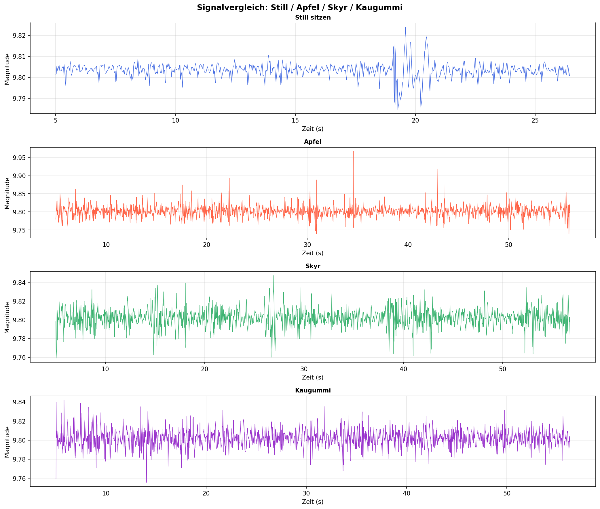
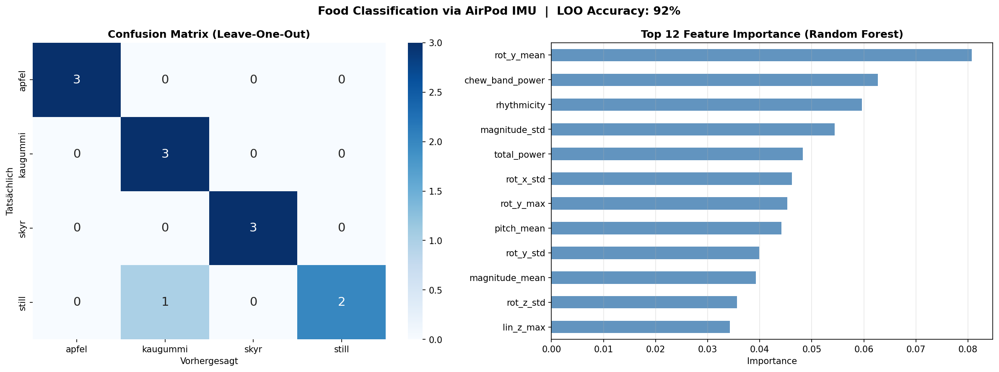
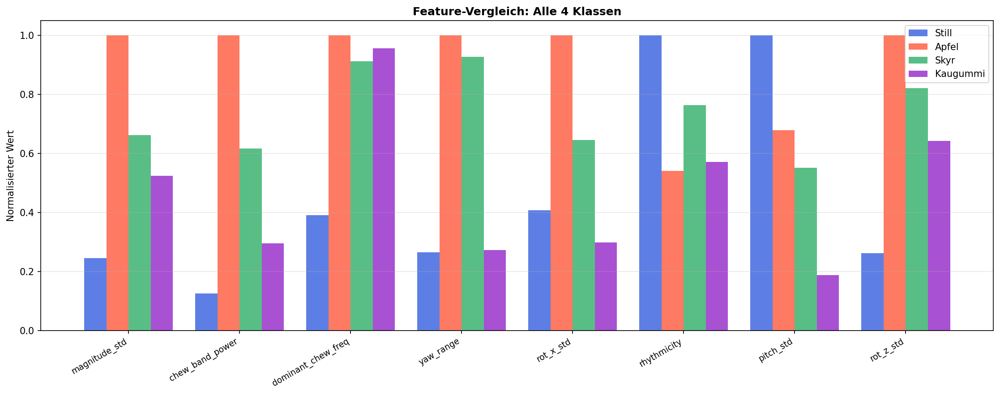

# Week 05 Report — Machine Learning for Smart and Connected Systems (ML4SCS)

## Weekly Goal

Define the project from scratch, collect the first dataset, and build a complete baseline pipeline — from raw sensor data to a working classifier — within the first week. This is the first report for this project, as the course was joined in Week 5 after leaving a previous group.

---

## Work Done This Week

### 0. Project Setup

After joining the course in Week 5 as a solo student, the project was defined and set up from scratch this week. The project investigates whether AirPod IMU sensor data can be used to classify foods based on chewing patterns. The central research question is:

> *Can the chewing motion captured via in-ear IMU sensors (AirPods Pro) distinguish between different foods — and between eating and not eating?*

Four food classes were defined: **apple**, **chewing gum**, **skyr/yogurt**, and **still** (not eating). Data was recorded using the **Sensor Logger** iOS app with AirPods Pro, capturing accelerometer, gyroscope, and Euler angle data (pitch, roll, yaw) at approximately **50 Hz**.

The GitHub repository was set up this week and organised into `data/raw/` for raw recordings, `src/` for processing scripts, `notebooks/` for exploration, and `results/` for plots and outputs.

---

### 1. Data Work

**Data collection:** A total of **12 sessions** were self-recorded — 3 per class, each approximately 60 seconds long. All sessions were exported as CSV files from Sensor Logger and stored as ZIP archives in `data/raw/`.

**Sensor channels recorded:**
- Linear acceleration: `accelerationX/Y/Z`
- Gravity vector: `gravityX/Y/Z`
- Gyroscope: `rotationRateX/Y/Z`
- Euler angles: `pitch`, `roll`, `yaw`

**Preprocessing steps applied to each session:**
1. The first and last 5 seconds of each recording were trimmed to remove startup artefacts and transition noise.
2. Linear acceleration was computed by subtracting the gravity vector from raw acceleration: `lin_x = accelerationX − gravityX` (and analogously for Y, Z).
3. A scalar magnitude signal was computed: `magnitude = √(lin_x² + lin_y² + lin_z²)`

The magnitude signal proved to be the most informative single channel, as it captures overall head/jaw movement intensity independent of sensor orientation.

---

### 2. Analysis / Modelling Work

**Feature extraction:** A total of **37 features** were extracted per session from three domains:

*Time domain (acceleration & rotation):*
- Mean, standard deviation, and maximum of linear acceleration (X, Y, Z) and magnitude
- Stillness ratio (fraction of samples with magnitude < 0.02)
- Movement events (samples above 75th percentile of magnitude)
- Mean, standard deviation, and maximum of gyroscope (X, Y, Z)

*Euler angle domain:*
- Mean, standard deviation, and range of pitch, roll, and yaw

*Frequency domain (FFT-based):*
- Dominant chewing frequency (peak frequency in 0.5–4 Hz band via Welch PSD)
- Chewing band power (summed PSD in 0.5–4 Hz)
- Total signal power
- Rhythmicity (chewing band power / total power)

**Model:** A **Random Forest classifier** was trained on the 12-session feature matrix. Leave-One-Out cross-validation (LOO-CV) was used to evaluate generalisation given the small dataset.

---

### 3. Repository / Documentation Work

- Repository initialised with `.gitignore`, `README.md`, and `requirements.txt`
- Folder structure created: `data/raw/`, `src/`, `notebooks/`, `results/`, `reports/`
- Scripts written: `preprocessing.py`, `train.py`, `evaluate.py`, `airpods_pipeline_v2.py`, `build_feature_matrix.py`
- Feature matrix exported to `feature_matrix_final.csv` (12 rows × 37 features)
- All result plots saved under `results/`

---

## Experiments Conducted

| Experiment | Change Made | Result | Interpretation |
|---|---|---|---|
| Exp 1 | Initial signal exploration: still vs. restless (T-1, T-2) | Visual distinction clearly visible in magnitude | Confirmed that IMU signal captures motion differences |
| Exp 2 | Expanded to all 4 food classes | Distinct signal patterns per class visible | Different foods produce characteristic chewing rhythms |
| Exp 3 | Added frequency-domain features (FFT/Welch) | Feature separability improved significantly | Chewing frequency (0.5–4 Hz band) is highly class-specific |
| Exp 4 | Random Forest + LOO-CV on full feature matrix | **92% LOO-CV accuracy (11/12 correct)** | Strong result for a 12-session dataset |

---

## Results

### Signal Comparison — All 4 Classes

The magnitude signal shows clearly distinct patterns per class. Still sitting produces a near-flat signal with very low variance, while all three food classes show rhythmic oscillations at different amplitudes and frequencies.

*Figure 1: Magnitude signal over time for one representative session per class. Still (blue) is flat, apple (red) shows irregular chewing bursts, skyr (green) shows steady rhythmic movement, and chewing gum (purple) produces rapid, lower-amplitude oscillations.*

---

### Feature Importance & Confusion Matrix (LOO-CV)

*Figure 2 (left): Leave-One-Out confusion matrix. Apfel, Kaugummi, and Skyr are classified perfectly (3/3). One Still session was misclassified as Kaugummi, yielding **92% overall LOO accuracy**.*

*Figure 2 (right): Top 12 feature importances from the Random Forest. `rot_y_mean`, `chew_band_power`, and `rhythmicity` are the most discriminative features — confirming that the frequency-domain approach adds significant value beyond simple time-domain statistics.*

---

### Feature Comparison Across Classes

*Figure 3: Normalised feature values for the 8 most important features across all classes. Apple shows the highest chewing band power and rot_x_std, while Still has the highest rhythmicity due to its constant low-level noise floor. Chewing gum and skyr are separated primarily by dominant chewing frequency and yaw range.*

---

## Challenges

The main challenge was the **very small dataset** (12 sessions total, 3 per class), which makes LOO-CV the only viable evaluation strategy and limits confidence in the result. The one misclassified still session highlights that resting head motion can occasionally resemble slow chewing, particularly for chewing gum. A larger dataset would improve robustness considerably.

A second challenge was the **frequency-domain feature extraction**: choosing the right frequency band (0.5–4 Hz) required manual inspection of power spectral densities per class to confirm it captured actual chewing and not artefact noise.

---

## Key Insights

- Chewing creates measurable and class-specific rhythmic patterns in AirPod IMU data even at 50 Hz.
- Frequency-domain features (chewing band power, rhythmicity) are the most discriminative — more so than raw time-domain statistics.
- The `rot_y_mean` gyroscope feature being the top predictor suggests that jaw-opening direction (left-right rotation) differs systematically between food types.
- 92% LOO accuracy on 12 sessions is a strong baseline that justifies extending the dataset.

---

## Plan for Next Week

- Record additional sessions to expand the dataset 
- Apply proper train/test split evaluation once dataset is large enough
- Investigate the one misclassified Still session (possible recording artefact)
- Explore feature selection to reduce dimensionality
- Working on the presentation

---

## Contributions

- Jonah Karstens: full project (solo) — project definition, data collection, preprocessing, feature engineering, modelling, evaluation, repository setup
