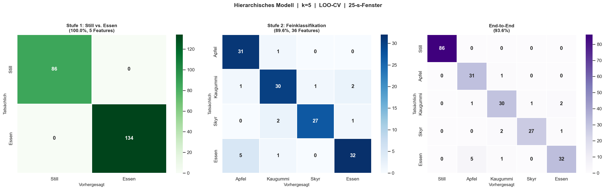
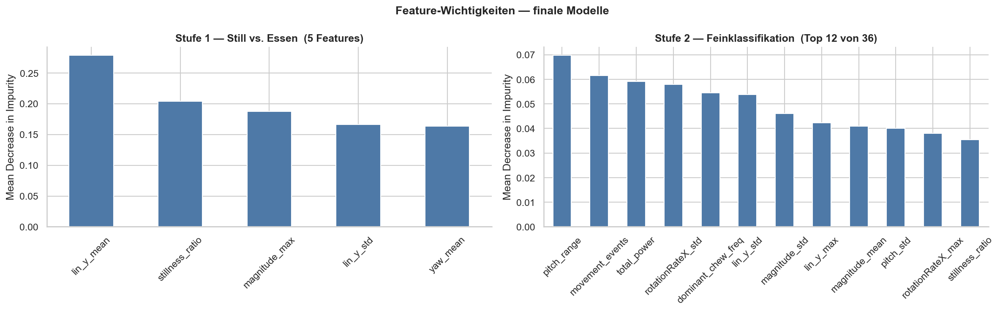
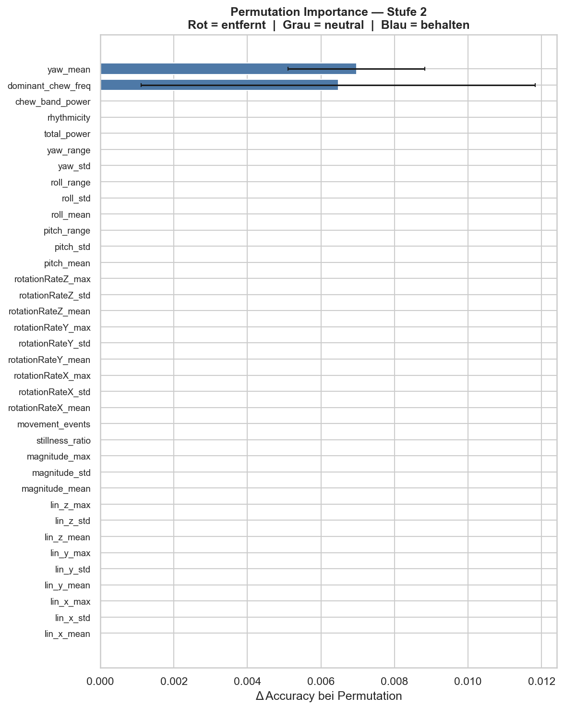

# Week 06 Report — Machine Learning for Smart and Connected Systems (ML4SCS)

## Weekly Goal

Prepare and deliver the intermediate presentation (Zwischenpräsentation), including related work analysis from relevant literature. In parallel, extend the modelling approach from a flat classifier to a hierarchical 2-stage model.

---

## Work Done This Week

### 0. Intermediate Presentation

The main focus of this week was preparing the **Zwischenpräsentation**. This included structuring the full project story — from motivation and data collection to the signal processing pipeline and current results — into a coherent slide deck. The presentation covers all three signal processing approaches (Low-Pass Filter, Hampel Filter, Movement-Segment Exclusion) and their comparative results on the 24-session dataset.

A German version of the presentation was also produced.

---

### 1. Related Work & Source Analysis

Three papers were read and analysed as part of the presentation preparation:

- **EarBit** (Bedri et al.): In-ear sensing for eating detection using multiple sensors (microphone, IMU, PPG). Achieves ~90% F1 on eating vs. not eating detection. Relevant because it validates the general feasibility of in-ear eating detection, though with richer sensor hardware.
- **CHOMP** (Ketmalasiri et al.): Chewing-side detection using earphone IMU. Focuses on left/right jaw asymmetry rather than food classification — directly adjacent to this project's approach.
- **IMChew** (S3 paper): IMU-based chewing detection with a focus on chew count estimation. Provides a reference for the 0.5–4 Hz chewing frequency band used in this project's FFT features.

These were summarised in a dedicated Related Work section in the presentation (slides 4–5).

---

### 2. Modelling Work — Hierarchical 2-Stage Classifier (Notebook 04)

A hierarchical classification model was developed as an architectural improvement over the flat Random Forest from previous weeks. The key idea is to decompose the problem into two cleaner sub-problems:

```
Stage 1 (coarse):   Still  ──vs──  Eating
                                      │
Stage 2 (fine):           Apfel · Kaugummi · Skyr
```

**Stage 1 — Still vs. Eating:**  
Trained on all sessions with a binary label. RFECV (5-fold CV) selected **5 features**: `stillness_ratio`, `magnitude_max`, `lin_y_mean`, `lin_y_std`, `yaw_mean`. LOO-CV accuracy: **100%** (up from 99.1% with all features).

**Stage 2 — Fine classification:**  
Trained only on eating sessions. Features with negative mean permutation importance were removed (see Figure 2). LOO-CV accuracy: **89.6%** (all features) vs. 88.1% (RFECV/18 features) → all features retained.

Additionally, a **25-second sliding window** segmentation was introduced: instead of treating each full session as one sample, sessions are split into non-overlapping 25-second windows. This multiplies the available samples for training and evaluation.

---

### 3. Data Collection — Edge Cases

One additional edge-case session was recorded: **Still_Sprechen_1** (speaking while sitting still). This tests whether the model misclassifies talking (jaw movement without food) as eating — a practically relevant failure mode. The session is automatically assigned to the *Still* class by the data loader (prefix match).

---

## Experiments Conducted

| Experiment | Change Made | Result | Interpretation |
|---|---|---|---|
| Exp 1 | Movement-exclusion threshold k = 3/5/7 on windowed data | k=5 best: Stage 1 99.1%, Stage 2 89.6% | k=5 retained as default |
| Exp 2 | RFECV feature selection for Stage 1 | 5 features → 100% LOO-CV | Smaller feature set actually improves coarse classifier |
| Exp 3 | RFECV for Stage 2 | 18 features → 88.1% | Slight drop — all features kept for Stage 2 |
| Exp 4 | Permutation importance pruning on Stage 2 | Removed negative-importance features | Stabilises model without accuracy loss |

---

## Results

### Confusion Matrices — All Three Classifiers



*Figure 1: LOO-CV confusion matrices. Left: Stage 1 (Still vs. Eating). Centre: Stage 2 (fine food classification). Right: End-to-end pipeline (Stage 1 → Stage 2 chained). The hierarchical architecture cleanly separates the easy binary problem (Stage 1) from the harder multi-class problem (Stage 2).*

---

### Feature Importance — Both Stages



*Figure 2: Top feature importances for the final Stage 1 model (left) and Stage 2 model (right, top 12 of the retained features). Stage 1 is dominated by `stillness_ratio` and `magnitude_max` — reflecting that Still simply has near-zero signal. Stage 2 relies more on rotation and frequency features to distinguish between food types.*

---

### Permutation Importance — Stage 2



*Figure 3: Permutation importance (15 repeats) for Stage 2. Features with negative mean importance actively harm generalisation and were removed before final LOO-CV evaluation.*

---

## Challenges

The main challenge this week was **time allocation**: preparing a complete intermediate presentation (including related work research) left limited time for deep modelling work. The windowed segmentation also complicates LOO-CV slightly — care is needed to ensure windows from the same session are not split across train and test folds.

---

## Key Insights

- Decomposing the problem into a 2-stage hierarchy significantly simplifies Stage 1 and makes it interpretable: only 5 features are needed to tell Still from Eating with 100% LOO-CV accuracy.
- The related work confirms that the 0.5–4 Hz chewing band is well-established — the feature choice is grounded in prior literature.
- Windowed segmentation substantially increases the number of training samples, which should improve robustness as the dataset grows.

---

## Plan for Next Week

Based on the presentation plan and feedback received during the Zwischenpräsentation, the focus for Week 7 is **dataset expansion**:

- Collect more sessions across all existing classes (Apfel, Kaugummi, Skyr, Still) to improve model robustness
- Based on feedback from the presentation, also train on additional food types (beyond the original four classes) to better generalise the eating vs. not-eating distinction — the model should recognise *any* eating activity, not just the three trained foods
- Begin recruiting additional subjects (friends, family) to evaluate subject-independence, as all recordings so far come from a single person
- Target: ~30 sessions per class from own recordings as a starting point

---

## Contributions

- Jonah Karstens: full project (solo) — presentation preparation, related work analysis, hierarchical model design and implementation, data collection (Still_Sprechen edge case)
