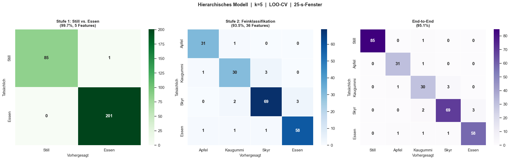
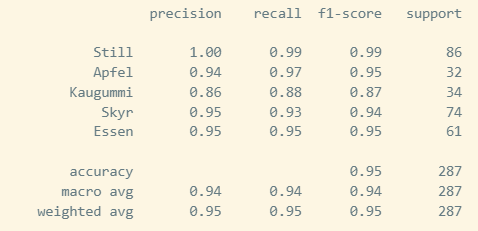
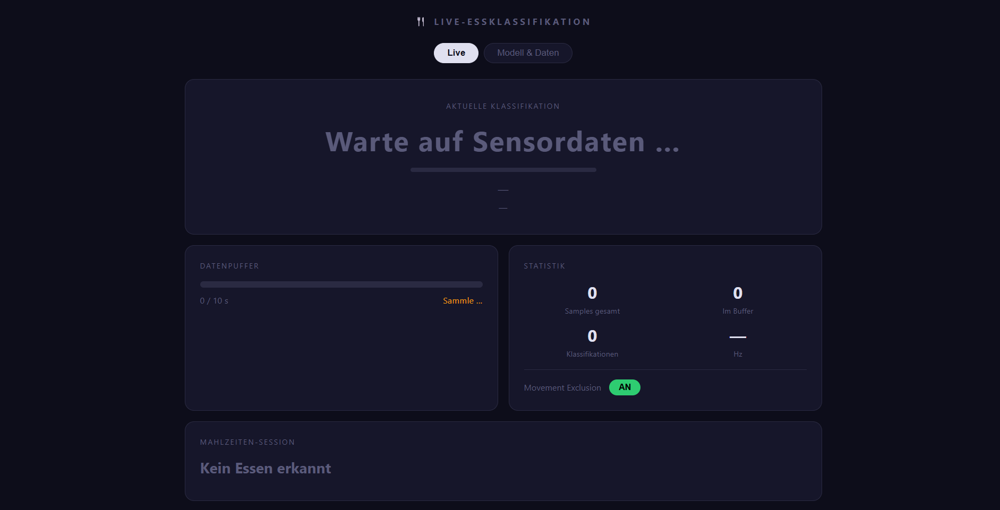
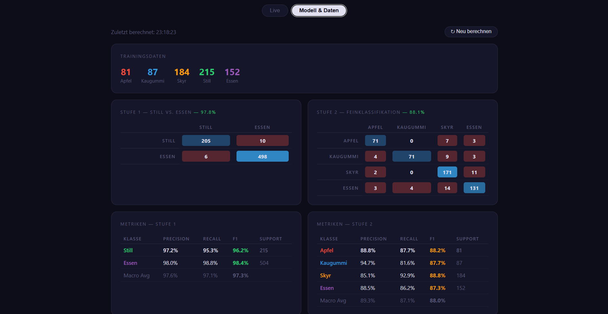

# Week 07 Report — Machine Learning for Smart and Connected Systems (ML4SCS)

## Weekly Goal

Expand the dataset across all classes, integrate the generic *Essen* class as discussed in Week 6 presentation feedback, and build a first version of a live web application that classifies food in real time from AirPod IMU data.

---

## Work Done This Week

### 1. Data Collection

Additional recording sessions were added across all classes. The dataset now contains **72 sessions** in total.

The **Essen** class (generic eating, introduced in Week 6) was expanded with additional sessions to give the model a broader representation of eating behaviour beyond the three labelled food types. This directly addresses the presentation feedback: the Stage 1 classifier should recognise *any* eating, not just apple, gum, or skyr.

After splitting sessions into 25-second windows, the training dataset consists of:
- Still: 86 windows — Apfel: 32 — Kaugummi: 34 — Skyr: 74 — Essen: 61

---

### 2. Modelling — Updated Results with Expanded Dataset

With more data and the additional Essen class, the hierarchical model was re-evaluated. Results improved across the board compared to Week 6.

*Figure 1: LOO-CV confusion matrices for the hierarchical 2-stage model (k=5, 25-second windows). Left: Stage 1 (Still vs. Essen, 99.7%, 5 features). Centre: Stage 2 (fine classification, 93.5%, 36 features). Right: End-to-end pipeline (95.1%).*

The end-to-end accuracy of **95.1%** is a significant improvement over the 89.6% Stage 2 result from Week 6. The main remaining confusion is between Skyr and Essen (generic), which is expected — both involve steady rhythmic chewing motion, and the generic Essen class is by design a catch-all for unlabelled eating behaviour.

*Figure 2: Classification report for the end-to-end pipeline. Macro-average F1: **0.94**. Still is classified near-perfectly (F1 0.99). Kaugummi is the weakest class (F1 0.87), likely because fast low-amplitude oscillations are harder to distinguish from generic eating at the feature level.*

---

### 3. Feature Selection

Feature selection proved to be the most challenging part of this week's work. The two-stage architecture requires separate feature sets for each model:

**Stage 1 (Still vs. Essen):** RFECV (5-fold CV) selected 5 features — `stillness_ratio`, `magnitude_max`, `lin_y_mean`, `lin_y_std`, `yaw_mean` — achieving 99.7% LOO-CV accuracy. This part is clean and well-behaved: the signal difference between still sitting and any eating is large and stable.

**Stage 2 (fine food classification):** Feature selection is much harder here. The classes are all chewing motions, differentiated only by frequency, amplitude, and rhythm. RFECV actually hurt accuracy slightly (88.1% vs. 93.5% with all features), so the final model retains all 36 features after removing those with negative mean permutation importance. Finding a principled feature subset that consistently generalises across sessions remains an open problem.

---

### 4. Live Web Application

The main deliverable of this week is a fully functional live classifier: `ml_httpstreaming/classifier_app.py`. The AirPods stream sensor data via the **Sensor Logger** iOS app to a local HTTP server, which feeds a continuously sliding 10-second buffer. Every 2 seconds, the buffer is classified by the hierarchical model and the result is pushed to a browser dashboard.

The app has two views:

**Live tab** — shows the current classification in real time:

*Figure 3: Live tab of the web dashboard. The large centre card shows the current food label and a confidence bar. Below: a data buffer progress bar (0–10 s fill before first classification), live statistics (samples, Hz, classification count), and a **Movement Exclusion toggle** (AN/AUS) that can be switched interactively. The session summary at the bottom tracks whether eating was detected during the current session.*

**Modell & Daten tab** — shows model performance computed on the training data:

*Figure 4: Modell & Daten tab. Shows training window counts per class, Stage 1 and Stage 2 confusion matrices, and full precision/recall/F1 metrics for both stages. A "Neu berechnen" button re-trains and re-evaluates on the current dataset. This makes it easy to check how adding new recordings affects model quality without opening a notebook.*

Key technical details of the app:
- **Sliding window:** 10-second buffer, classification every 2 seconds
- **Movement Exclusion:** can be toggled on or off at runtime via the web UI, allowing direct comparison of classification behaviour with and without the adaptive threshold
- **Classification log:** each session writes a timestamped CSV (e.g. `classification_log_20260529_221108.csv`) recording label, confidence, Stage 1 confidence, and the 5 Stage 1 features per window
- **Sensor server** (`sensor_server.py`): separate lightweight HTTP server for receiving raw POST requests from the Sensor Logger app, with live Hz display per sensor channel

---

## Experiments Conducted

| Experiment | Change Made | Result | Interpretation |
|---|---|---|---|
| Exp 1 | Added Essen class + more sessions across all classes | End-to-end: 95.1% LOO-CV (up from ~89.6%) | More data and broader Essen class improve generalisation significantly |
| Exp 2 | RFECV on Stage 2 | 88.1% (18 features) vs. 93.5% (all features) | Feature reduction hurts Stage 2 — all features retained |
| Exp 4 | Movement Exclusion toggle in live app | Qualitative comparison in real use | Without exclusion, head movements during eating cause false "Still" predictions |

---

## Challenges

**Feature selection for Stage 2** was the hardest problem this week. With 5 classes that all involve chewing, many features carry overlapping information and no single subset clearly dominates. RFECV is computationally expensive and unstable across runs at this dataset size.

**Live deployment** required careful handling of the streaming pipeline: the sliding buffer needs to discard movement-excluded samples correctly, and Stage 1 has a minimum confidence threshold (0.95) to avoid borderline still/eating windows being passed to Stage 2 incorrectly.

---

## Key Insights

- End-to-end accuracy of 95.1% on a 5-class problem with only IMU data from consumer earphones is a strong result for this stage of the project.
- The Movement Exclusion toggle in the live app immediately makes the effect visible: without it, any head movement during a meal disrupts the classification stream noticeably.
- The Essen (generic) class is working well as a catch-all — it catches eating behaviour outside the three labelled classes without heavily confusing the fine classifier.
- Feature selection for the fine-grained stage remains genuinely difficult and will likely require domain-informed feature engineering rather than purely algorithmic selection.

---

## Plan for Next Week

- Recruit additional subjects (friends, family) for recordings to begin evaluating subject-independence — all data so far is from one person
- Increase session count toward the ~30/class target from the Week 7 plan
- Investigate cross-subject generalisation: train on Person A, test on Person B
- Explore motion-invariant feature design to improve Stage 2 robustness

---

## Contributions

- Jonah Karstens: full project (solo) — data collection (all classes incl. Skyr variants), hierarchical model update, feature selection experiments, live web application development
