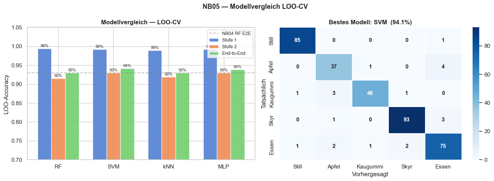
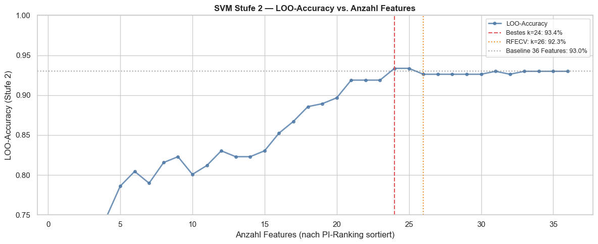
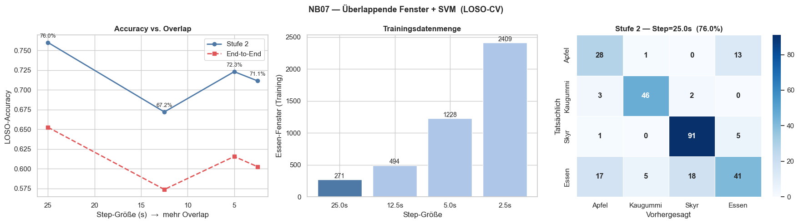
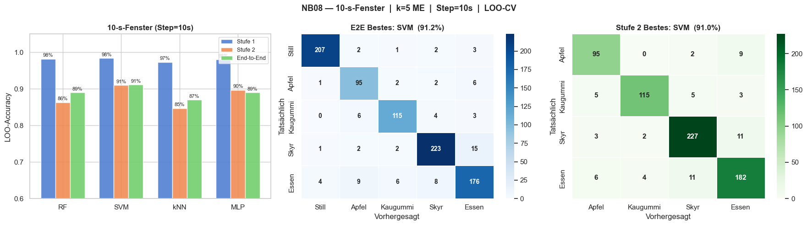

# Week 08 Report — Machine Learning for Smart and Connected Systems (ML4SCS)

## Weekly Goal

Evaluate alternative classifiers beyond Random Forest, investigate feature selection for SVM, and experiment with different window configurations. Due to limited time this week, the focus was on modelling analysis rather than data collection.

---

## Work Done This Week

### 1. Data Collection

A small number of additional sessions were recorded, bringing the dataset to **78 sessions** in total. No major expansion was possible this week due to time constraints.

---

### 2. Model Comparison — NB05

The hierarchical 2-stage pipeline was evaluated with four classifiers (RF, SVM, kNN, MLP) using 25-second non-overlapping windows and LOO-CV. All models perform similarly — none dominates by a large margin — but **SVM achieves the best end-to-end accuracy at 94.1%**, just ahead of MLP (94%) and RF/kNN (both 93%).

*Figure 1: Left: LOO-CV accuracy for all four classifiers across Stage 1, Stage 2, and End-to-End. The dashed line marks the NB04 Random Forest baseline (92%). Right: Confusion matrix for the best model (SVM, 94.1% E2E). Main remaining errors are Apfel↔Essen and Kaugummi↔Apfel confusion.*

SVM is selected as the primary classifier going forward — the advantage over RF is modest but consistent.

---

### 3. Feature Selection for SVM — NB06

Feature selection was investigated specifically for SVM Stage 2, using a sequential approach ranked by permutation importance. The optimal subset is **k=24 features (93.4%)**, marginally better than the full 36-feature baseline (93.0%). RFECV selected k=26 but achieved only 92.3%.

*Figure 2: LOO-Accuracy for SVM Stage 2 as a function of feature count (features added in PI-rank order). The curve plateaus around k=20–24. The best point (k=24, red dashed line) gives a marginal +0.4% over the full feature set. The gain from feature selection is real but small.*

The result confirms the finding from earlier weeks: feature selection for the fine-grained stage is hard and yields only incremental improvements. The top 24 features are retained for the SVM pipeline.

---

### 4. Overlapping Windows — NB07 (LOSO-CV)

Overlapping sliding windows were tested to increase training data volume. Contrary to expectations, **more overlap makes accuracy worse**, not better. With step=25s (no overlap) Stage 2 LOO-SO-CV reaches 76%; shrinking the step to 2.5s inflates the window count to 2409 but accuracy drops to ~71%.

*Figure 3: Left: Stage 2 and End-to-End accuracy as step size decreases (more overlap). Centre: Training window count per step size. Right: Confusion matrix at step=25s (best setting). Overlapping windows create correlated samples that inflate apparent training set size while introducing data leakage in LOSO-CV — windows from the same session end up in both train and test.*

This is an important finding: for this dataset, **non-overlapping windows are the correct choice**. Overlapping windows inflate the sample count but leak information across folds.

---

### 5. 10-Second Windows — NB08

The window length was reduced from 25s to 10s (step=10s, no overlap) to test whether shorter windows work for the live application (which also uses 10s). Results are slightly lower but still strong: **SVM achieves 91.2% E2E**, best among all four classifiers.

*Figure 4: Left: LOO-CV for all classifiers on 10-second windows. SVM leads at 91.2% E2E. Right: SVM confusion matrices for End-to-End (centre) and Stage 2 only (right). The main confusion remains Essen↔Skyr and Essen↔Apfel — generic eating is the hardest class to separate.*

The 10-second window result is particularly relevant: the live app already uses 10-second buffers, so 91.2% is a realistic estimate of real-world performance.

---

## Experiments Conducted

| Experiment | Change Made | Result | Interpretation |
|---|---|---|---|
| Exp 1 | RF / SVM / kNN / MLP on 25-s windows | SVM best: 94.1% E2E | All models similar; SVM chosen going forward |
| Exp 2 | Sequential feature selection (PI-ranked) for SVM | k=24 → 93.4% (+0.4% vs baseline) | Marginal gain; feature selection remains hard |
| Exp 3 | Overlapping windows (LOSO-CV) | Accuracy drops with more overlap | Data leakage in folds; non-overlapping windows correct choice |
| Exp 4 | 10-second windows, all models | SVM best: 91.2% E2E | Realistic live-app performance estimate |

---

## Challenges

The biggest challenge this week was **data from other people**. All 78 sessions recorded so far are from a single subject — myself. Recruiting others (friends, family) for recordings is difficult as I live alone, which makes spontaneous in-person sessions impossible. This remains the most critical open issue for subject-independent evaluation.

---

## Key Insights

- SVM is the best model, but the margin over RF and MLP is small (~1%). The choice of classifier matters less than data quality and quantity at this stage.
- Overlapping windows hurt generalisation in LOSO-CV due to data leakage — a non-obvious finding worth documenting.
- 10-second windows work well (91.2%), which validates the live-app design.
- Feature selection provides diminishing returns beyond ~20 features for Stage 2.

---

## Plan for Next Week

- Actively recruit additional subjects for recordings — coordinate remotely if needed
- Evaluate cross-subject generalisation once data from a second person is available
- Potentially refine the live app based on real-use observations

---

## Contributions

- Jonah Karstens: full project (solo) — model comparison, feature selection analysis, window experiments, small dataset expansion
