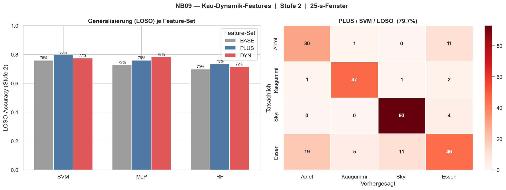
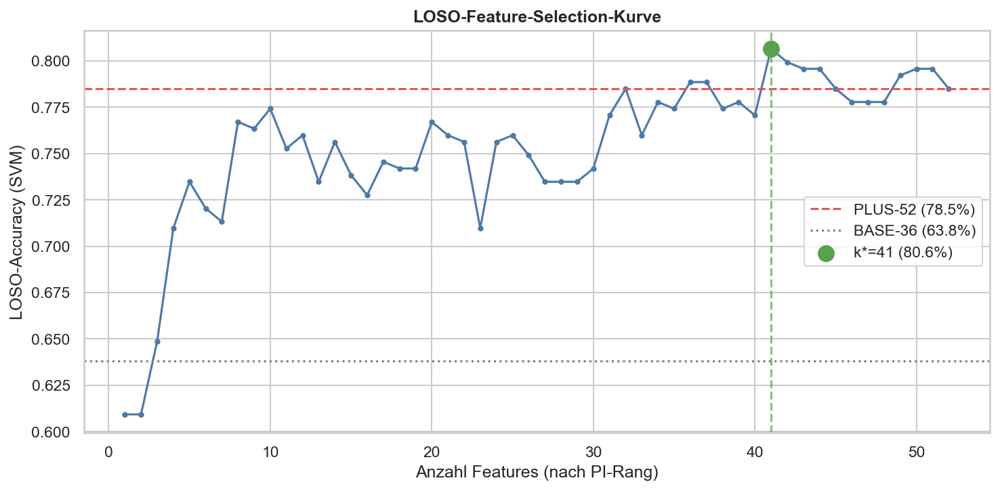
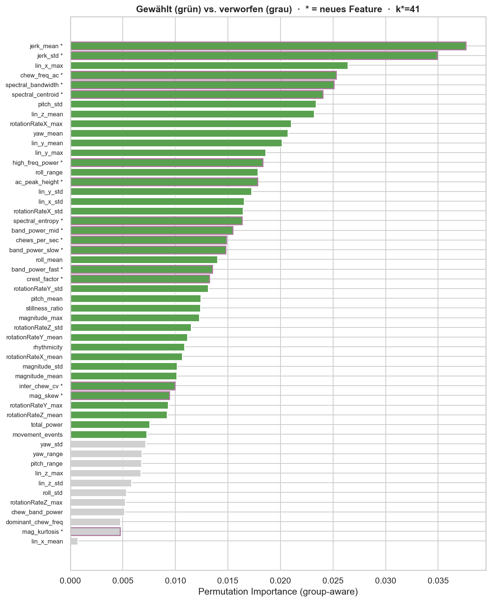

# Week 09 Report — Machine Learning for Smart and Connected Systems (ML4SCS)

## Weekly Goal

Continue the modelling focus from Week 8 with a deeper push on **feature engineering and model refinement**: extract richer chewing-dynamics features, test whether deep learning can learn better features than hand-crafted ones, combine feature engineering with cross-session feature selection, diagnose the remaining error modes — and finally **implement the best configuration in the live app**. As in Week 8, no significant new data collection was possible (still single-subject); one additional Apfel session was added.

Throughout this week the headline metric is **LOSO** (Leave-One-Session-Out), the honest cross-session estimate from Week 8's NB07 — not the optimistic per-window LOO.

---

## Work Done This Week

### 1. Feature Engineering — NB09

The existing ~36 features are mostly statistical aggregates (mean / std / max per axis). **16 new chewing-dynamics features** were added, each physically motivated for the specific foods:

- **Impulsivity** (→ Apfel): `mag_kurtosis`, `mag_skew`, `crest_factor`
- **Rhythm regularity** (→ Kaugummi): `spectral_entropy`, `ac_peak_height` (autocorrelation), `inter_chew_cv`
- **Frequency sub-bands**: slow / mid / fast chewing + `high_freq_power` (4–15 Hz crunch energy)
- **Dynamics**: `jerk_mean/std`, `chews_per_sec`, `chew_freq_ac`

Every configuration was evaluated with **both LOO and LOSO**, because the real test is whether new features improve *cross-session* generalisation, not the already-saturated within-session LOO.

*Figure 1: Stage-2 LOSO accuracy for three feature sets (BASE-36, PLUS-52, DYN-16) across SVM/MLP/RF. PLUS lifts SVM LOSO from 76.0% to 79.7%. Notably, the DYN-only set (16 new features) generalises almost as well as all 36 base features — evidence that many base features (absolute orientation/position) are session-specific noise.*

**Result:** PLUS-52 → **79.7% LOSO** (SVM), up from 76.0%. The most important generalising feature turned out to be a new one, `chews_per_sec`.

---

### 2. Deep Learning vs. Feature Engineering — NB10

To answer "couldn't a deep model learn its own features?", a **1D-CNN** was trained on the **raw 10-s windows** (7 channels: accel x/y/z, gyro x/y/z, magnitude), with **data augmentation** (jitter, amplitude scaling, time-shift). The CNN and the NB09 feature-SVM were compared on the **same** `GroupKFold(5)` session splits for a fair head-to-head.

| Model | Cross-session accuracy (Stage 2, 10-s) |
|---|---|
| CNN (raw, no augmentation) | 62.8% |
| CNN (raw) + augmentation | **70.4%** |
| SVM (PLUS features) | 68.8% |

**Finding:** Augmentation is the single biggest lever (**+7.6 pts**). With augmentation the CNN roughly **ties** the feature-SVM but does not beat it; the best overall result remains feature engineering at 25-s windows (79.7%). At this data scale, hand-crafted features with domain knowledge are at least as good as learned ones — the bottleneck is **data/session diversity, not model capacity**.

---

### 3. Feature Engineering + LOSO Feature Selection — NB11

Combining the two ideas (NB09 engineering ⊕ NB06 selection): rank all 52 features by **group-aware permutation importance**, then select the subset that maximises LOSO.

*Figure 2: LOSO accuracy as features are added in importance order. The optimum is k*=32 features at 86.0% LOSO, well above PLUS-52 (79.7%) and BASE-36 (76.0%).*

*Figure 3: Group-aware permutation importance per feature. Green = kept, grey = dropped, purple edge = new feature. The most harmful feature is `roll_mean` (absolute phone orientation); the most helpful is `chews_per_sec` (new). Dropped features are predominantly absolute-position/orientation aggregates — session-specific noise.*

**Result:** SELECTED-32 → **86.0% LOSO** (SVM), a **+6.3 pt** gain over PLUS-52, by *removing* 20 features. The same 32-feature subset also lifts the MLP (76.4% → 82.7%), confirming the effect transfers across models and is not SVM-specific overfitting.

> **Honesty note:** k* was chosen on the same LOSO it reports, so 86.0% is mildly optimistic (selection bias). A nested estimate would be somewhat lower, but clearly above the 79.7% baseline.

---

### 4. Diagnosing the Remaining Errors — Apfel ↔ Essen

Error analysis of the best model showed that **almost all remaining errors are a mutual Apfel↔Essen confusion**; Skyr (98%) and Kaugummi (84%) are essentially solved. Two root causes were identified:

1. **"Essen" is a generic catch-all** (real recordings: lunch foods like chili con carne, overnight oats) that overlaps the specific foods in feature space — a labelling/taxonomy issue, not a model bug.
2. **Movement Exclusion was removing apple's crunch.** The exclusion step (designed to drop large non-chewing movements) also strips the impulsive crunch peaks that are the *only* signal separating hard Apfel from soft lunch food.

A sweep over the exclusion strength confirmed cause 2:

| Movement Exclusion | Stage-2 LOSO | Apfel recall | Apfel→Essen errors |
|---|---|---|---|
| k=5 (current) | 76.3% | 62% | 18 |
| k=12 (mild) | 76.0% | 64% | 17 |
| **off** | **78.1%** | **78%** | **10** |

Removing the exclusion lifts Apfel recall by **+16 points** and nearly halves the Apfel↔Essen confusion.

A **reject-option** was also tested (train Stage 2 only on the specific foods; fall back to "Essen" below a confidence threshold). It makes the specific foods excellent (Apfel up to 94%) but **generic Essen is *confidently* misclassified**, so overall accuracy drops — confirming the overlap is a high-confidence labelling issue, not low-confidence uncertainty.

---

### 5. Live App Implementation

All validated findings were implemented in `ml_httpstreaming/classifier_app.py`:

| Component | Before | After |
|---|---|---|
| Movement Exclusion | on | **off** (preserves crunch) |
| Stage-2 model | Random Forest | **SVM** (RBF, C=10, with scaling pipeline) |
| Features | 36 base | **52** (+ chewing dynamics) |
| Feature selection | permutation importance (not group-aware) | **group-aware / LOSO-like** |

The app's existing **temporal voting** (`MealSession`) was reviewed and already realises per-meal aggregation: each window casts a vote and the majority label is the meal result. Per-meal accuracy is **87%** vs. 78% per-window — voting smooths out single-window errors, and at the meal level Apfel and Essen reach 100%.

The upgrade was **validated offline** (no live stream needed): the app trains and classifies without error, Stage-2 LOO is **86.7%** with **Apfel recall 86%** (previously the weak class), and `classify()` returns the correct label on held-out Apfel / Skyr / Still windows.

---

## Experiments Conducted

| Experiment | Change Made | Result | Interpretation |
|---|---|---|---|
| Exp 1 | +16 chewing-dynamics features (NB09) | PLUS-52 LOSO 79.7% (+3.7) | New features help cross-session generalisation |
| Exp 2 | 1D-CNN on raw data + augmentation (NB10) | CNN+Aug 70.4% ≈ SVM 68.8% | DL ties but doesn't beat FE at this data scale |
| Exp 3 | LOSO-driven feature selection (NB11) | SELECTED-32 LOSO 86.0% (+6.3) | Removing session-specific features is the biggest lever |
| Exp 4 | Movement exclusion sweep | off → Apfel 62%→78% | Exclusion was removing the discriminative crunch |
| Exp 5 | Reject-option for generic "Essen" | specific foods ↑, overall ↓ | "Essen" overlap is a labelling issue, not confidence |
| Exp 6 | Implement all in live app | LOO 86.7%, Apfel 86%, validated | Findings deployed and verified offline |

---

## Challenges

- **Single-subject data remains the ceiling.** Every experiment confirms the same bottleneck from Week 8/NB07: the model is user-specific and the honest LOSO number is limited by session diversity, not by the model. Recruiting additional subjects is still the critical open issue.
- **The "Essen" class is intrinsically ambiguous.** It is a generic umbrella (mixed lunch foods) that physically overlaps the specific foods — no model or threshold cleanly separates confidently-overlapping classes.

---

## Key Insights

- **Feature engineering + pruning session-specific features is the biggest win this week**: LOSO rose from 76.0% (baseline) to 86.0% by adding chewing-dynamics features and then *removing* absolute-orientation noise features.
- **Deep learning does not beat feature engineering at this data scale** — augmentation is what matters most, and even then the CNN only ties the feature-SVM.
- **Movement Exclusion was quietly hurting Apfel** by stripping the crunch impulses — a non-obvious fine-tuning win (+16 pts Apfel recall).
- **Temporal voting (already in the app) turns 78% per-window into 87% per-meal** — the live system is more reliable than the per-window numbers suggest.
- **Everything was implemented and validated**, not just analysed: the live app now runs the SVM + engineered-feature + no-exclusion pipeline.

---

## Plan for Next Week

- Multi-subject data collection — still the #1 lever for real improvement
- Live testing of the upgraded app; confirm the Apfel improvement in real use
- Nested cross-validation for an unbiased estimate of the feature-selection gain
- Reconsider the "Essen" class definition (relabel by actual food, or restructure as a true "other" class)

---

## Contributions

- Jonah Karstens: full project (solo) — feature engineering (NB09), CNN vs. feature-engineering experiment (NB10), LOSO feature selection (NB11), error diagnosis (movement exclusion, reject-option), and live-app implementation + offline validation.
