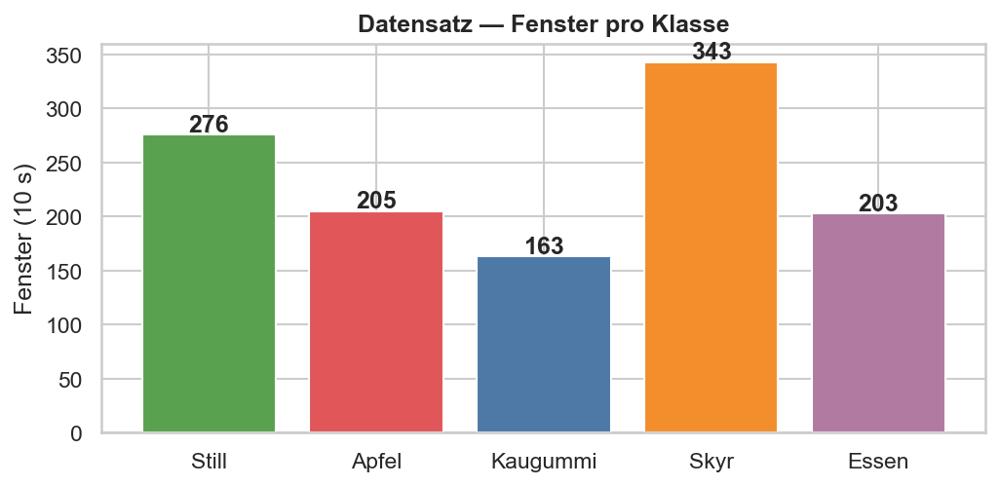
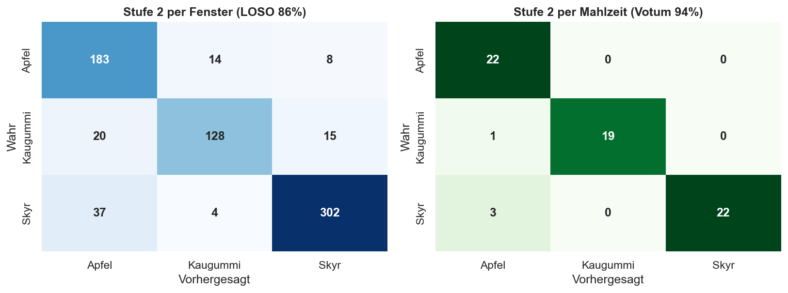
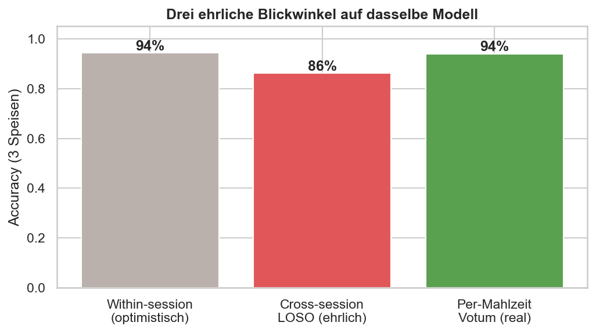

# Week 10 Report — Machine Learning for Smart and Connected Systems (ML4SCS)

## Weekly Goal

Finalise the model and pipeline for the upcoming final presentation: lock in the class design, build one compact end-to-end notebook telling the whole story, and polish the live app into a robust demo.

---

## Work Done This Week

### 1. Data

The dataset grew to **89 sessions** (single subject): Apfel 22, Kaugummi 20, Skyr 25, Still 18, plus 4 generic "Essen" (other food) recordings. `Skyr_Zimt` is folded into Skyr.

### 2. Final architecture decision — 3 classes, 2 stages

The biggest change this week: **dropping the generic "Essen" class from the food classifier.** Error analysis showed nearly all remaining errors were a mutual Apfel↔Essen confusion — the generic "Essen" recordings (soft lunch food like chili or overnight oats) overlap the specific foods in feature space and were *confidently* misclassified, dragging **Apfel precision down to 0.53**.

The final design:
- **Stage 1 (Still vs. Essen):** Random Forest. The generic "Essen" recordings *are* eating, so they are kept here to strengthen eating detection.
- **Stage 2 (Apfel / Kaugummi / Skyr):** SVM trained only on the 3 concrete foods.

Removing generic "Essen" from Stage 2 lifted **Apfel precision from 0.53 to 0.76** with no downside for the other classes.

### 3. Results (LOSO — cross-session, the honest metric)

| | Accuracy |
|--|--|
| Stage 1 (Still vs. Essen) | **86 %** |
| Stage 2 (3 foods) — per window | **86 %** |
| Stage 2 (3 foods) — **per meal** (majority vote) | **94 %** |

Per-class f1 (Stage 2): Apfel 0.82 · Kaugummi 0.83 · Skyr 0.90.

The three-way evaluation (within-session 94 % · cross-session 86 % · per-meal 94 %) is the core honesty message: within-session overestimates, LOSO is realistic, and per-meal voting recovers most of the gap.

### 4. Final presentation notebook

A single compact notebook (`12_final_presentation.ipynb`) now tells the whole story end-to-end: idea → data → features → 2-stage model → honest evaluation → "what made the difference" → live app. It runs top-to-bottom and saves all presentation figures.

### 5. Live-app polish

The real-time app (`classifier_app.py`) was hardened into a demo-ready state:
- **Stale-stream fix:** when the phone stops streaming, the app shows "no signal" instead of silently repeating the last window.
- **Dual movement-exclusion models (hybrid):** Stage 1 *always* uses movement exclusion for robust still-detection (no false "eating" on head movement), while Stage 2 follows a toggle — off preserves Apple's crunch, on filters movement. This fixed both failure modes seen in live testing (head-movement→food, and still→food).
- **Session details:** completed meals are clickable and open a detail view with the vote breakdown.
- Stage-1 confidence threshold tuned (0.95 → 0.75) so apple eating actually passes Stage 1.

---

## Experiments Conducted

| Experiment | Change | Result |
|---|---|---|
| Exp 1 | Drop generic "Essen" from Stage 2 | Apfel precision 0.53 → 0.76 |
| Exp 2 | Movement-exclusion sweep | off → Apfel recall +16 pts; on → robust still-detection |
| Exp 3 | Hybrid: Stage 1 always ME, Stage 2 by toggle | both still-detection and apple crunch work |
| Exp 4 | Per-meal majority voting | 86 % per window → 94 % per meal |

---

## Challenges

- **Stage 1 vs. Stage 2 want opposite preprocessing.** Movement exclusion helps still-detection but removes apple's crunch. Resolved with the hybrid (different setting per stage).
- **Single-subject data** remains the ceiling for cross-session generalisation.

---

## Key Insights

- The biggest accuracy lever was **class design** (dropping the overlapping generic class), not the model.
- A single global preprocessing choice is wrong when the two stages have opposite needs — per-stage settings are better.
- Per-meal voting is what makes the live system reliable (94 %), even when per-window accuracy is 86 %.

---

## Plan for Next Week

- Final presentation (2.7. / 9.7.): research question, literature, demo, data/experiment overview, preliminary results.
- Architecture diagram + live demo for the talk.
- (Stretch) first multi-subject recordings.

---

## Contributions

- Jonah Karstens: full project (solo) — final architecture, presentation notebook, live-app hardening, evaluation.
