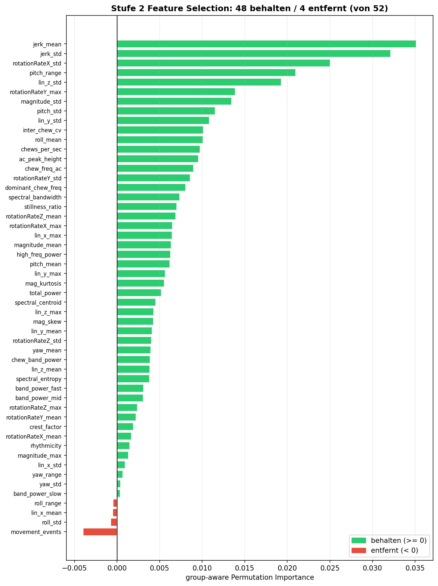
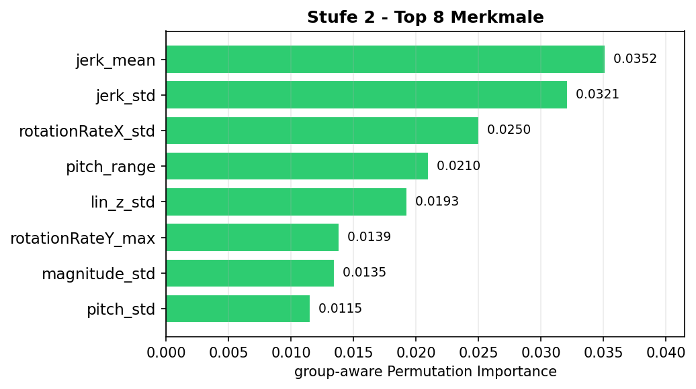

# Week 11 Report — Machine Learning for Smart and Connected Systems (ML4SCS)

## Weekly Goal

Wrap up the project: validate the Stage-2 feature set, finalise all presentation figures, and prepare the final presentation slides. This week closes out the work started in [Week 10](week10.md).

---

## Work Done This Week

### 1. Stage-2 feature selection — validation (`14_feature_selection_s2.ipynb`)

The last open question from Week 10 was whether the SVM (Stage 2) really needs all engineered features. A new notebook validates the feature set with **group-aware permutation importance** (sessions as groups, identical setup to the live app, ME off = deploy default).

- 711 food windows · 67 sessions · **52 features** evaluated.
- **48 kept**, **4 dropped** (`movement_events`, `roll_std`, `lin_x_mean`, `roll_range`) — all with importance ≤ 0, i.e. no useful signal for the 3-food task.
- The dropped features are exactly the movement/rotation ones that matter for Stage 1 (still-detection) but not for discriminating the three foods — consistent with the per-stage-preprocessing insight from Week 10.

### 2. Presentation figures finalised

The remaining story figures were rebuilt into their final versions:
- `final_features_v2.png`, `final_pipeline_v2.png` — cleaned-up feature and pipeline overview.
- `final_stufe1_optimierung.png` — Stage-1 tuning.
- `final_endtoend_confusion.png`, `final_endstand.png` — end-to-end result and final standing.

### 3. Final presentation slides

The talk deck (`chewML_Abschlusspräsentation_final.pdf`) is assembled and ties the whole project together: research question → data → features → 2-stage model → honest LOSO evaluation → live demo. It builds directly on the compact end-to-end notebook (`12_final_presentation.ipynb`) from last week.

---

## Key Insights

- The feature set is now **empirically justified**: 48 of 52 features carry signal for Stage 2, and the 4 that don't are precisely the movement features Stage 1 relies on — the two stages genuinely want different inputs.
- Nothing in the validation contradicted the Week-10 architecture; the 3-class / 2-stage design and the per-meal voting (94 %) hold up.

---

## Status

Project complete. Final presentation on **2.7. / 9.7.** — slides, figures, and the live-app demo are ready.

---

## Contributions

- Jonah Karstens: full project (solo) — Stage-2 feature validation, final figures, presentation slides.
</content>
</invoke>
